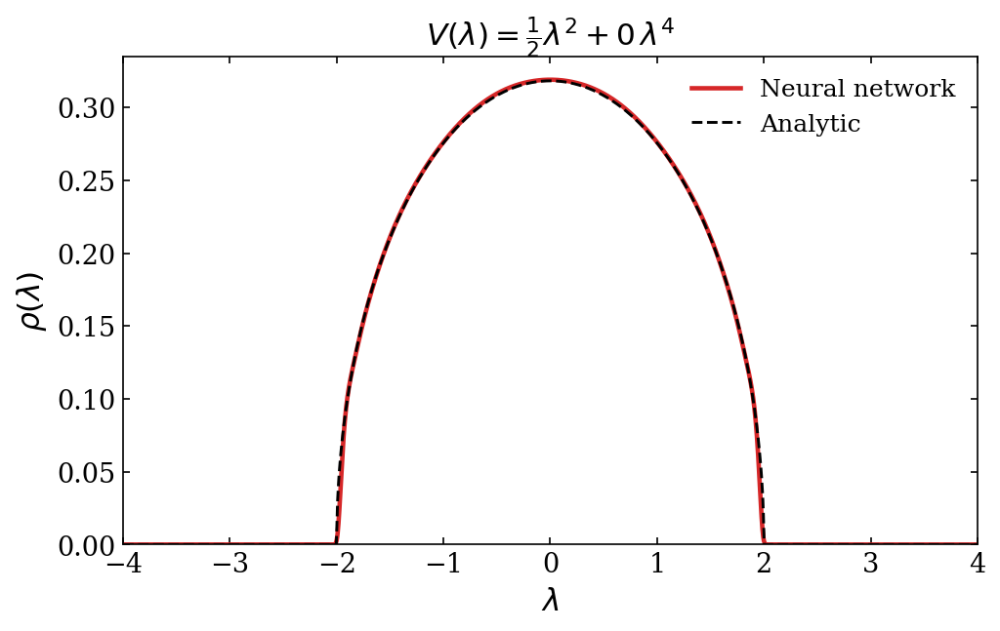
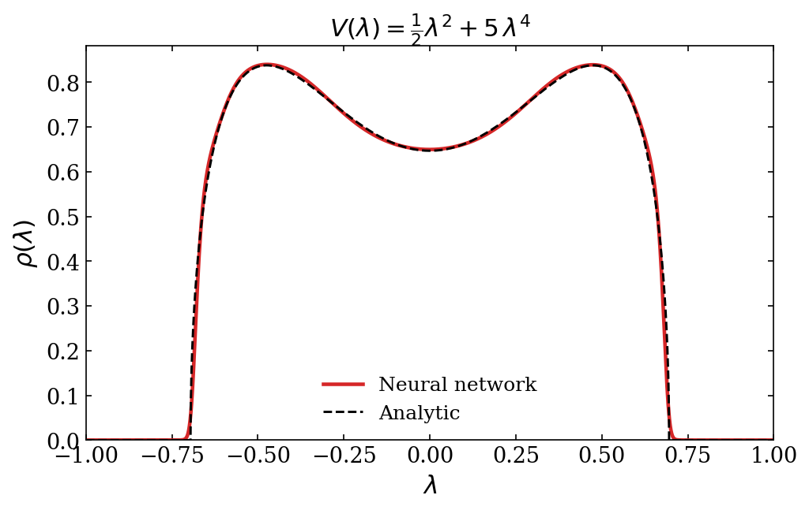
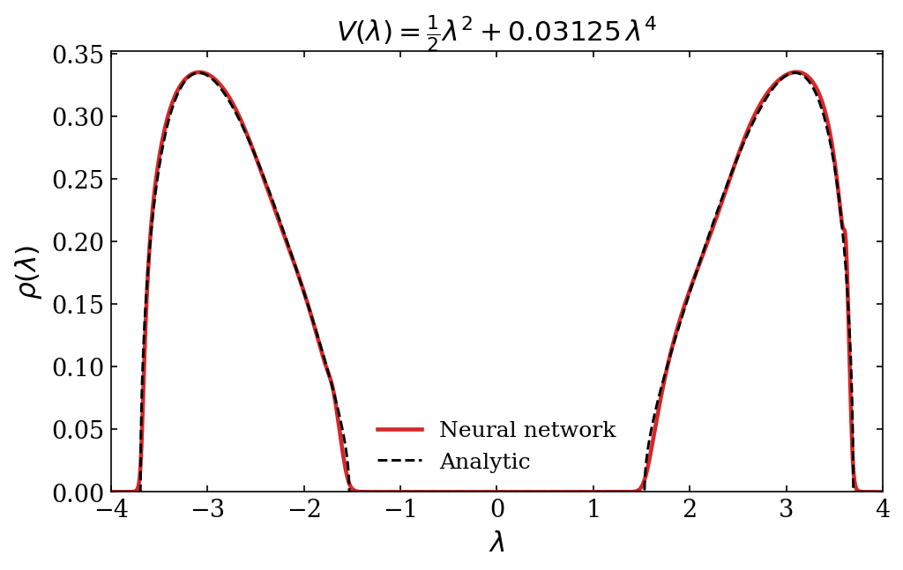

# Neural Network for matrix models

A neural network approach to solve large $N$ matrix models.

Instead of solving saddle-point equations analytically, we parameterize the eigenvalue density $\rho(\lambda)$ as a neural network and minimize the matrix model effective action directly via gradient descent.

## The idea

In the large $N$ limit of a Hermitian one-matrix model with potential $V(\lambda)$, the eigenvalue density minimizes the action functional

$$S[\rho] = N^2 \left[\int V(\lambda)\,\rho(\lambda)\,d\lambda - \int \int \log|\lambda - \mu|\,\rho(\lambda)\,\rho(\mu)\,d\lambda\,d\mu\right]$$

subject to $\rho \geq 0$ and $\int \rho = 1$.

We represent $\rho$ using a neural network $f_\theta\colon \mathbb{R} \to \mathbb{R}$ via

$$\rho_\theta(\lambda) = \frac{e^{f_\theta(\lambda)}}{\int e^{f_\theta(\lambda')}\,d\lambda'}$$

which enforces positivity and normalization by construction. The action is estimated on a discretization grid and minimized with standard backpropagation.

## Results

### Gaussian potential: $V(\lambda) = \frac{1}{2}\lambda^2$

The network recovers the Wigner semicircle law $\rho(\lambda) = \frac{2}{\pi}\sqrt{1 - \lambda^2}$.



### Quartic potential (one-cut): $V(\lambda) = \frac{1}{2}\lambda^2 + g\,\lambda^4$

For moderate quartic coupling, the saddle point is a deformed semicircle supported on a single interval.



### Quartic potential (two-cut): $V(\lambda) = \frac{1}{2}\lambda^2 + g\,\lambda^4$

When the kinetic term is reversed and for sufficiently small $g$, the $\mathbb{Z}_2$-symmetric two-cut solution emerges, with support on two disjoint intervals.



## Architecture

The network is a fully connected MLP with Tanh activations:

```
Input (1) → [Linear → Tanh] × 6 → Linear → Output (1)
```

Hidden dimension: 256. The raw output is passed through the continuous softmax to produce a normalized density.

## Training

- **Optimizer:** Adam, learning rate $10^{-3}$
- **Epochs:** 4000
- **Grid:** 2000 points on $[-4, 4]$ via `torch.linspace`
- **Integrals:** trapezoidal rule; double integral computed on the full $M \times M$ grid with diagonal excluded

## Dependencies

- Python 3.10+
- PyTorch
- Matplotlib
