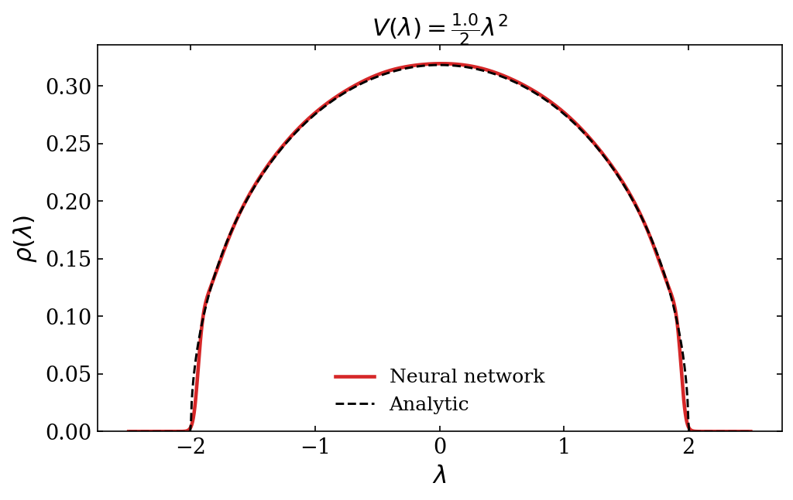
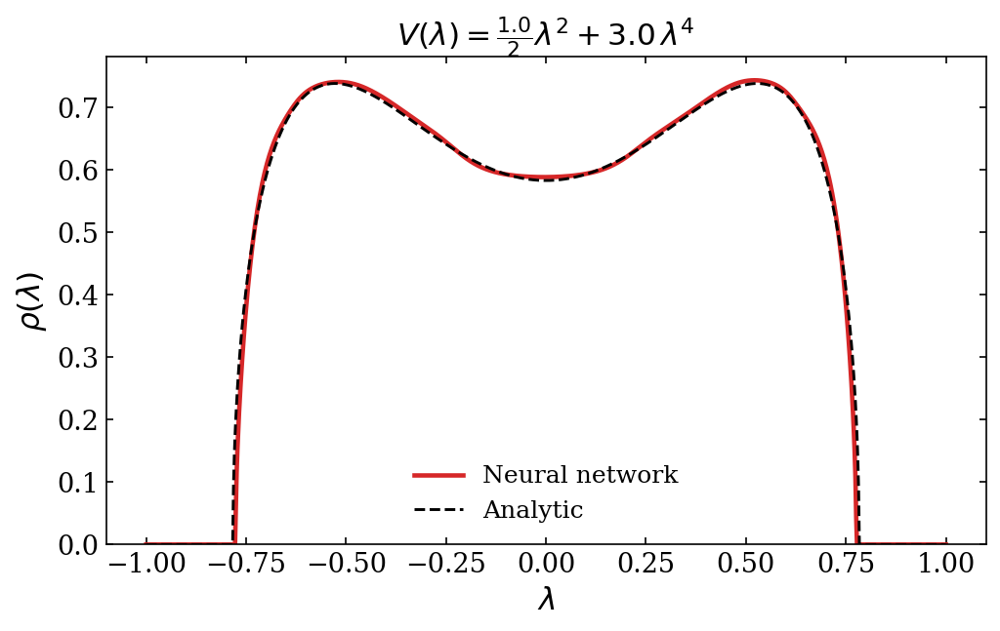
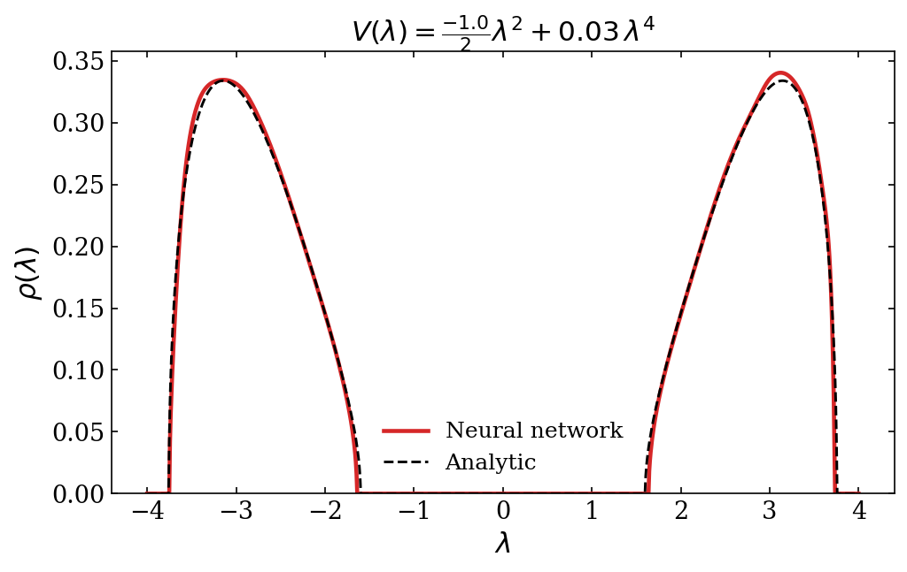
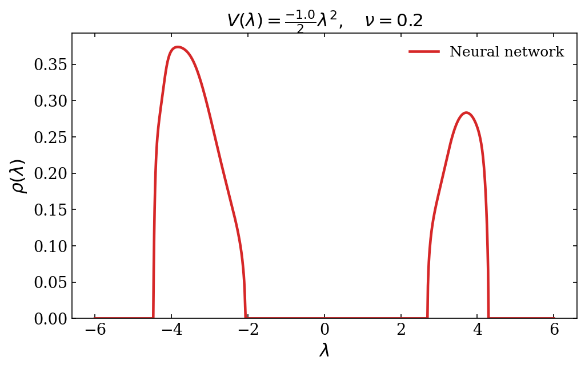

# Neural Network for matrix models

A neural network approach to solve large $N$ matrix models.

We parameterize the eigenvalue density $\rho(\lambda)$ as a neural network and minimize the matrix model effective action directly via gradient descent.

## The idea

In the large $N$ limit of a Hermitian one-matrix model with potential $V(\lambda)$, the eigenvalue density minimizes the action functional

$$S[\rho] = N^2 \left[\int V(\lambda)\rho(\lambda)d\lambda - \int \int \log|\lambda - \mu|\rho(\lambda)\rho(\mu)d\lambda d\mu\right]$$

subject to $\rho \geq 0$ and $\int \rho = 1$.

We represent $\rho$ using a neural network $f_\theta\colon \mathbb{R} \to \mathbb{R}$ via

$$\rho_\theta(\lambda) = \frac{\sqrt{\mathrm{ReLU}(f_\theta(\lambda))}}{\int \sqrt{\mathrm{ReLU}(f_\theta(\lambda'))}\,d\lambda'}$$

This ansatz enforces positivity and normalization by construction. It also produces **compact support**: the density is exactly zero wherever $f_\theta < 0$, and exhibits the square-root edge behavior $\rho \sim \sqrt{\lambda - a}$ characteristic of matrix model solutions. The network only needs to learn a smooth function that changes sign at the support boundaries — the correct singular structure comes for free from the architecture.

The action is estimated on a discretization grid and minimized with standard backpropagation.

## Results

### Gaussian potential: $V(\lambda) = \frac{1}{2}\lambda^2$

The network recovers the Wigner semicircle law $\rho(\lambda) = \frac{2}{\pi}\sqrt{1 - \lambda^2}$.



### Quartic potential (one-cut): $V(\lambda) = \frac{1}{2}\lambda^2 + g\,\lambda^4$

For positive mass and quartic coupling, the saddle point is a deformed semicircle supported on a single interval.



### Quartic potential (two-cut): $V(\lambda) = -\frac{1}{2}\lambda^2 + g\,\lambda^4$

For negative mass, the $\mathbb{Z}_2$-symmetric two-cut solution emerges, with support on two disjoint intervals. The network discovers the disconnected support automatically from the action alone.



### Filling fractions

For the two-cut solution, one can impose a filling fraction $\nu = \int_0^\infty \rho\,d\lambda$ to select $\mathbb{Z}_2$-breaking saddle points. This is enforced via a penalty term in the loss. The example below uses $\nu = 0.2$.



## Architecture

The network is a fully connected MLP with Tanh activations:

```
Input (1) → [Linear → Tanh] × 6 → Linear → Output (1)
```

Hidden dimension: 256. The raw output is passed through $\sqrt{\mathrm{ReLU}(\cdot)}$ and normalized to produce the density.

## Training

- **Optimizer:** Adam, learning rate $10^{-3}$
- **Epochs:** 5000
- **Grid:** 1000 points on $[-L, L]$ via `torch.linspace`, with $L$ set to cover the support
- **Integrals:** trapezoidal rule; double integral computed on the full $M \times M$ grid with diagonal excluded

## Usage

```bash
# Gaussian potential
python train.py

# Quartic potential with g4 = 3
python train.py --g4 3

# Two-cut solution with negative mass
python train.py --m -1 --g4 0.03 --L 5

# Two-cut with filling fraction
python train.py --m -1 --g4 0.02 --L 5 --nu 0.2

# Plot results (same flags as training)
python plot.py --g4 3
```

## Dependencies

- Python 3.10+
- PyTorch
- Matplotlib

## References

- E. Brézin, C. Itzykson, G. Parisi, J.B. Zuber, *Planar Diagrams*, Commun. Math. Phys. **59** (1978) 35–51
- P. Di Francesco, P. Ginsparg, J. Zinn-Justin, *2D Gravity and Random Matrices*, Phys. Rept. **254** (1995) 1–133, [arXiv:hep-th/9306153](https://arxiv.org/abs/hep-th/9306153)
